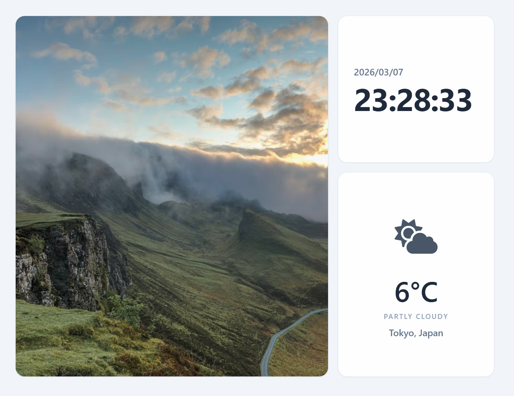

# 機能一覧

## ダッシュボード

日々の生活に役立つ情報を表示するダッシュボード機能を提供します。ダッシュボードは
シックでシンプルなデザインを採用し、必要な情報を見やすく配置します。
表示言語は英語とします。
ダッシュボードの表示サイズはSXGA（1280x1024）を想定しています。



※ `design.png` は [designExample.html](designExample.html) のスクリーンショットです。
レイアウトや表示要素の仕様は **HTML（designExample.html）を正** とします。

## 表示内容

ダッシュボードは以下の情報を表示します

- 時刻（ローカルタイムゾーンで表示）
- 天気情報（現在の気温、天気コードの簡易ラベル）
- ローカルディレクトリに同期された画像（複数枚からランダム表示、定期更新）

各機能について後述します。

## 時刻

ローカルタイムゾーンで現在の時刻を表示します。表示は `HH:MM:SS` の形式とします。時刻は1秒ごとに更新されます。

※日付（YYYY/MM/DD）の表示は現状未対応です。

## 天気情報

起動オプションで指定した緯度経度の現在の天気を表示します。表示内容は以下の通りです。
- 現在の気温（摂氏）
- 天気コードの簡易ラベル（例: CLEAR/CLOUDS/RAIN など）

天気情報は一定間隔で更新されます（デフォルト10分）。
天気情報の取得には Open-Meteo API を使用します。
取得に失敗した場合でも、最後に取得できたキャッシュがあればそれを表示します。

## 画像（Google Driveからの同期を想定）

Google Drive 上の画像は、アプリが直接取得しません。
`rclone` 等で **ローカルディレクトリへ同期した画像** を、ダッシュボードが参照して表示します。

- 画像は複数枚ある場合ランダムに切り替えます
- 画像の切り替え間隔・ディレクトリの再スキャン間隔は設定で変更できます

運用例は [run-on-raspberrypi.md](run-on-raspberrypi.md) を参照してください。

## 設定（起動オプション）

現状の実装では JSON の設定ファイルは使用せず、起動時の **コマンドラインフラグ** で設定します。

主な設定項目は以下です。

- 天気情報の緯度経度（`-lat`, `-lon`）
- タイムゾーン（`-tz`）
- 画像ディレクトリ（`-photos_dir`）
- 画像の切り替え間隔（`-photo_interval`）
- 画像ディレクトリの再スキャン間隔（`-photo_rescan_interval`）
- 天気情報の更新間隔（`-weather_interval`）

その他、開発用に FrameBuffer を使わず描画結果を PNG として出力する `-preview_dir` などのフラグもあります。

### 起動例

```bash
./bin/dashboard-linux-armv6 \
  -fb /dev/fb0 \
  -photos_dir /var/lib/dashboard/photos \
  -cache_dir /var/lib/dashboard/cache \
  -lat 35.681236 -lon 139.767125 \
  -tz Asia/Tokyo \
  -photo_interval 1m \
  -photo_rescan_interval 5m \
  -weather_interval 10m
```